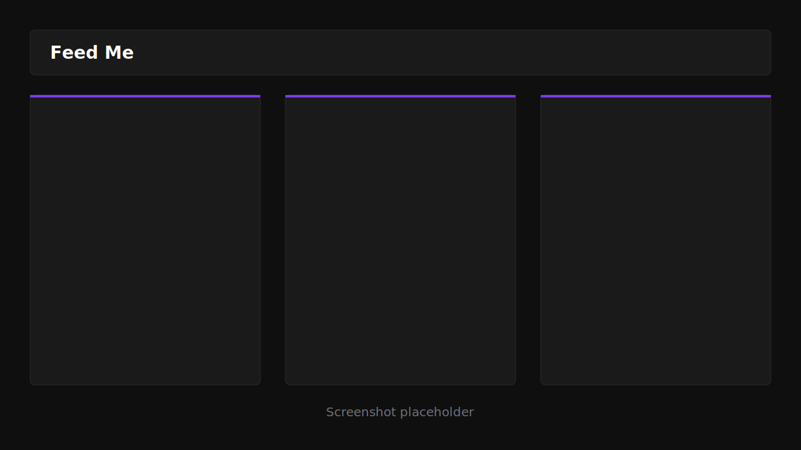

# Feed Me

Feed Me is a local-first RSS reader built with React, TypeScript, Vite, Tailwind CSS, Zustand, and an Express RSS proxy. Feeds render as draggable, resizable cards in a 12-column dashboard. Settings, card layout, cached articles, and display preferences persist in localStorage.

## Screenshot



## Prerequisites

- Node.js 18+
- npm

## Setup

Install root dependencies:

```bash
npm install
```

Install server dependencies:

```bash
npm install --prefix server
```

Start the Vite app and Express proxy together:

```bash
npm run dev
```

The app runs at `http://localhost:5173`. The RSS proxy runs at `http://localhost:3001`.

## Adding Feeds

Open settings with the gear button, enter an RSS or Atom URL, add an optional label, then submit. Feed Me validates the URL through the backend proxy before saving it. Each saved feed can be enabled, disabled, edited, deleted, and configured with image visibility, article count, refresh interval, and card accent color.

## Tech Stack

| Area | Technology |
| --- | --- |
| Frontend | React, TypeScript, Vite |
| Styling | Tailwind CSS v3, Inter |
| Layout | react-grid-layout |
| State | Zustand with localStorage persistence |
| Icons | lucide-react |
| Backend | Node.js, Express |
| RSS Parsing | rss-parser |
| Dev Runner | concurrently |

## Scripts

```bash
npm run dev      # Start Vite and the RSS proxy
npm run build    # Build the frontend
npm run preview  # Preview production frontend build
```

Server-only commands:

```bash
npm run dev --prefix server
npm run build --prefix server
```
